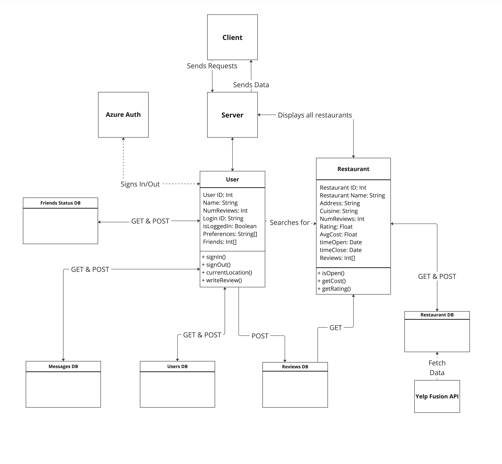

# Foodie-Finder
*This application was developed By: Minh Mai, Matthew So, Joseph Tran*

This repository contains the code for our application that we developed for INFO 441 (*Server-Side Development*) at the University of Washington Information School in Autumn 2023.

Link to Deployed Application: https://foodiefinder.joseph-tran.me/

## Project Proposal
### Project Description 

"Foodie Finder" is an innovative application designed to connect food enthusiasts and provide a seamless solution for college students seeking quick, affordable meal options.

Foodie Finder is primarily aimed at students at the University of Washington, especially incoming freshmen, with plans to expand its user base across major United States cities gradually. There are various reasons why our audiences would want to use our application, with the primary reasons being convenience and time-saving. College students typically have a hectic schedule. As a result, they want quick and easy access to nearby restaurant information. "Foodie Finder" provides them with a single point of reference for all restaurants, saving them time and effort in determining which restaurant to choose from. This is also true for incoming freshmen who want easy access to nearby restaurant information to save time searching for restaurants, especially in an unfamiliar location. Aside from that, our application can be used to foster social connections and friendships, especially because it can connect users with similar culinary interests. These features will be extremely beneficial to college students, particularly incoming freshmen who place a high value on making new friends. While there are some existing solutions, such as Yelp, Trip Advisor, Google Travel, and Instagram, they do not offer a strong focus on fostering social connections and recommending affordable restaurants.

As developers, we address clear market demand for connecting food enthusiasts, fostering new friendships for incoming freshmen, and delivering easily accessible and affordable restaurant information for busy college students. By harnessing the power of the Yelp Fusion API, we are committed to constructing a sophisticated recommendation engine built upon a detailed database of restaurant information. Our motivation to create this application comes from several reasons, the main being to create a memorable college experience for our peers. We understand that college is not just about academics; it is also a moment about personal growth and building long-lasting relationships. We want to create a memorable college experience for our peers, especially considering our personal experience as international and out-of-state students coming to the college without knowing anyone. All of this fuels our motivation to create this application to help our peers in a similar situation.

### Technical Description

Our "Foodie Finder" application will consist of three main components: the client-side, server-side, and database. The communication between these components will be facilitated through a `REST API`.

**Client** - The client-side web application developed for both desktop and mobile platforms. It will have user interfaces for browsing, searching, and reviewing restaurants.

**Server** - The server side will host the application's business logic and will manage user accounts, reviews, restaurant data, food cuisine, and geographical location data for recommending nearby users. It will communicate with the `Yelp Fusion API` to fetch restaurant data and expose its own `REST API` to the client for data retrieval and submission. It will also communicate with `Azure` to authenticate a user to save preferences and friend lists. `Azure` will supply a user ID, which will be used to look up and retrieve user application preferences from the Users database.

**Database** - We will use a `MongoDB database` to store user data, reviews, cuisine keywords, geographical data, and additional application-specific data. We intend to split up the database as follows:

- **Users**: Will store user ID, preferences, personal information, average rating across all reviews they gave, and friend lists.
- **Reviews**: Will store the user ID of the poster, restaurant ID, review, rating, and any subcomments to a review.
- **Restaurants**: Will store the restaurant ID, opening and closing hours, address, and average restaurant rating from platform users.
- **Friends**: Will store the ID of two user's and their friendship status.
- **Messages**: Will store small chats between friends.

These databases will be accessible to the server for data retrieval and storage. Additionally, we hope to populate certain parts of the databases with existing data by fetching from `Yelp's Fusion API`. This data includes the opening time, closing time, address, and menu.

**Outside API** - Yelp Fusion, Documentation found [here](https://docs.developer.yelp.com/docs/fusion-intro). We intend to obtain basic restaurant information such as opening and closing times, address, and menu. The API will not be used for the reviews feature.

#### Summary Table of User Stories

|Priority|User Story|Technical Implementation|
| :----: | -------- | ---------------------- |
|P0|As an incoming freshman and a foodie, I want to meet new friends who share my passion for cuisine and appreciate the same flavors, so I can make more friends and enjoy delightful food experiences together|Search through the `MongoDB database` on nearby user with similar geographical data type /zip code and similar cuisine keywords from the `Yelp API`|
|P0|As a student/user, I want to search for affordable restaurants nearby campus so that I can save money when eating out|Implement a search feature to search our `MongoDB` for existing location data and price level and fetch them from the `Yelp API`. After getting the data from the API, filter the locational data first then sort by the price level to find the optimal recommendation.|
|P0|As a student/user, I want to know which restaurants stay open late, allowing me to grab a meal after some extended study or when I'm looking for a late-night dining spot.|Implement a search feature to search our `MongoDB` for existing location data and price level and fetch them from the `Yelp API`. After getting the data from the API, filter out the closed restaurants based on the open hours from the API, then filter by location and sort by the price level to find the optimal recommendation.| 
|P0|As a student/user, I want to be able to save my eating preferences and be able to see the friends that I have made on the application.|Implement Azure authentication and utilize a `MongoDB database` to store preferences and IDs of users who are friends.|
|P1|As a user, I want to be able to filter for certain cuisines or dishes that I would want to eat.|Add a filter option to sort restaurants by cuisine.|
|P2|As a user, I want to receive personalized restaurant recommendations.|Implement a recommendation engine.|

#### Application Endpoints and Their Purpose

| Endpoint | Body / Parameters / Queries | Purpose / Use Case | 
| -------- | --------------------------- | ------------------ | 
| GET /getInfo | ?username |  Retrieve selected user information from database. | 
| POST /getInfo | {name, zipcode, favCuisine, favDish, favRestaurant, allergies, diet} | Add a new user's personal information. |
|GET /restaurants/search_yelp | ?restaurant, ?location, ?numrestaurant | Search for new restaurants that haven't been added to Foodie Finder yet. |
| POST /restaurants/search_yelp | {restaurantId} | Add a new restaurant to Foodie Finder. |
| GET /interactions/save-restaurant |?restaurantId | Add a favorite restaurant. |
| GET /interactions/remove-restaurant |?restaurantId | Remove a favorite restaurant. |
|GET /interactions/get-favorite | ?user | Get a user's list of favorite restaurants saved.|
| GET /restaurants | /:restaurant_id | Retrieve detailed information about a specific restaurant, such as name, address, price levels, and hours of operation, reviews |
| POST /restaurants/addReview | {restaurant_id, reviewInput, rating, recommend} | Allow users to submit a review for a specific restaurant. |
| GET /reviews/user | ?username | Obtain all specified user reviews. |
| GET /reviews/restaurant | ?restaurant_id | Obtain all specified restaurant reviews. |
| DELETE /reviews | {reviewID} | Removing a review |
| GET /users/friendsRec | N/A | Obtains friend recommendations with the same favorite cuisine and/or zip code. |
| GET /users/friendsSendAccpet | ?ReceiverName | Allows a user to send a new friend request to someone in Foodie Finder. | 
| GET /users/friendsUnSendAccpet | ?ReceiverName | Allows a user to unsend a new friend request to someone in Foodie Finder. | 
| GET /users/request | N/A | A new friend request was sent to the user. |
| GET /users/myIdentity | N/A | Checks user’s current authentication status. | 
| GET /users/friendAccept | {ReceiverName} | Allows users to accept a new friend request that was sent to them. |
| GET /users/pending | N/A | Viewing all of the user’s pending friend requests. | 
| GET /users/friend | N/A | Viewing all of the user’s friends. |
| GET /users/unfriend | {ReceiverName} | Removing a user’s friend. |
|GET /users/getmessage | {ReceiverName} | Check to see if the user’s friend sent a message. | 
|GET /users/message | {ReceiverName} | Allows the user to send a message to a friend. | 
|GET /auth/signin| N/A |Handles user sign in via Microsoft Azure authentication.|
|GET /auth/signout| N/A |Handles user sign out via Microsoft Azure authentication|

#### Architectural Diagram

[Link to Architectural Diagram for First and Final Draft](https://miro.com/app/board/uXjVNSe6MdA=/?share_link_id=328684345020)

*Image 1: Foodie Finder Architectural Diagram*

## Apendix
### Database Schemas
**User** = new mongoose.Schema({name: String, username: String, zipCode: { type: Number, default: 98105 }, favorite_cuisine: String, favorite_dish: String, favorite_restaurant: String, allergies: String, diet: String, SavedRestaurant: { type: [String], default: [] }, friends: { type: [String], default: [] }, ratings: {type: [Number], default: []},});

**Reviews** = new mongoose.Schema({restaurant_name: String, restaurant_id: String, reviewer_id: String, reviewer_post: String, reviewer_rating: Number, would_recommend: Boolean, created_date: {type: Date, default: Date.now},});

**Restaurant** = new mongoose.Schema({restaurant_id: String, name: String, image: String, phoneNum: String, location: Object, coordinates: Object, cuisine: [String], orderType: [String], ratings: [Number], price: String, avgRating: {type: Number, default: 0.0 }, hours: Object, favoriteUsers: [String],});

**Friend Process** = new mongoose.Schema({SenderName: String, receiverName: String, Status: String});

**Messages** = new mongoose.Schema({senderName: String, receiverName: String, message: String, date: Date});
